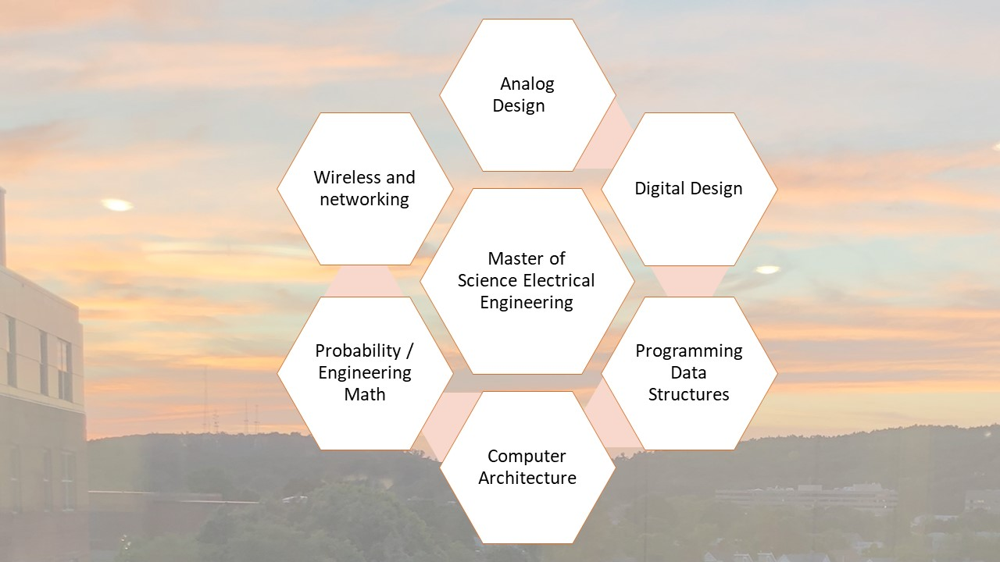

# Design Engineering

Overview of the project is provided. Confidential information is not displayed. Images are custom.

### MSEE
Further details reference: https://github.com/alpaddesai/EngineeringMathematics,  https://github.com/alpaddesai/SemiConductorSolidStateDevices,   https://github.com/alpaddesai/FundamentalsComputerEngineering, https://github.com/alpaddesai/Microwave-Engineering, https://github.com/alpaddesai/DataStructures, https://github.com/alpaddesai/IntroductionToMachineLanguageProgramming, https://github.com/alpaddesai/VerilogHDL,   https://github.com/alpaddesai/PowerElectronics, https://github.com/alpaddesai/AnalogDesign,   https://github.com/alpaddesai/ComputerArchitecture,    https://github.com/alpaddesai/RFDesign, https://github.com/alpaddesai/VLSI_Design, https://github.com/alpaddesai/ProbabilityStochasticProcesses, https://github.com/alpaddesai/FinanceForEngineers, https://github.com/alpaddesai/DigitalLogicHDL and https://github.com/alpaddesai/SmartGridDesignIdea.

• Received “Employee Recognition Awards” at Teradyne Inc. April 2010 • Received “Teradyne Employee Core Value Award” at Teradyne Inc. Dec 2006 • Winner of McCallum Graduate School of Business Leadership Scholarship Award 2008–2009 • Received “SWE Outstanding Student award 2004-2005” Society of Women Engineers •

#### Popular Vote Project: https://github.com/alpaddesai/VolunteerCommunityServicesinAmerica

Additional details reference https://github.com/alpaddesai/GraduateDegrees 
