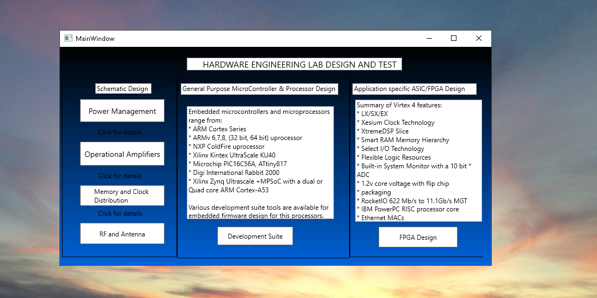

# Design Engineering

Overview of the project is provided. Confidential information is not displayed. Images are custom.

Additional details reference https://github.com/alpaddesai/HardwareEngineeringLab4-

### MSEE
Further details reference: https://github.com/alpaddesai/EngineeringMathematics,  https://github.com/alpaddesai/SemiConductorSolidStateDevices,   https://github.com/alpaddesai/FundamentalsComputerEngineering, https://github.com/alpaddesai/DataStructures, https://github.com/alpaddesai/IntroductionToMachineLanguageProgramming, https://github.com/alpaddesai/VerilogHDL,  https://github.com/alpaddesai/WirelessandMobileSystems, https://github.com/alpaddesai/PowerElectronics, https://github.com/alpaddesai/AnalogDesign,   https://github.com/alpaddesai/ComputerArchitecture,    https://github.com/alpaddesai/ProbabilityStochasticProcesses, https://github.com/alpaddesai/FinanceForEngineers, https://github.com/alpaddesai/DigitalLogicHDL, and https://github.com/alpaddesai/SmartGridDesignIdea.

#### Paid Employment: https://github.com/alpaddesai/DataStructures
#### Sample Revenue Generating Projects: https://github.com/alpaddesai/HardwareEngineeringLab4- 
#### Popular Vote Project:  https://github.com/alpaddesai/VolunteerCommunityServicesinAmerica
#### Popular Vote Exam: https://github.com/alpaddesai/GraduateAptitudeTest_Electronics_Communications 
#### Popular Vote Topic: Computer Architecture Exam:  https://github.com/alpaddesai/UdemyCertificationsComputerScience
#### Entrance Test: https://github.com/alpaddesai/GraduateRecordExamTestScores 
#### Admission Letter: https://github.com/alpaddesai/GraduateDesignEngineeringSchoolAdmissionLetter
#### Cover Letters: https://github.com/alpaddesai/JobSearch and https://github.com/alpaddesai/DesignEngineering_CoverLetters
#### Learning with certifications https://github.com/alpaddesai/UdemyCertificationsMSEE

